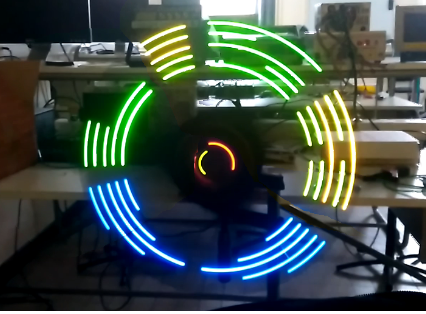
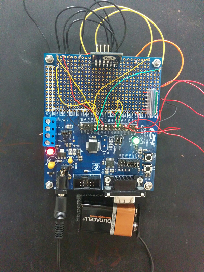
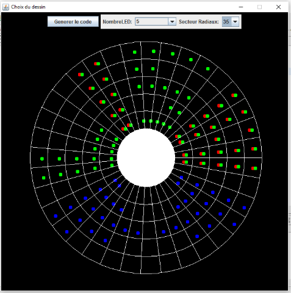
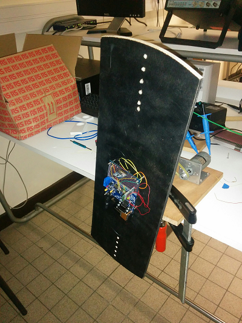

# veloLed

An electronic project aiming to build a LED line that can draw various form when linked with a wheel.

Youtube demonstration video

It looks like a homemade MonkeyLight bicycle device.

Made with a C8051F310 Silicon Laboratories microcontroller, an ADXL345 Analog Device accelerometer and a EGBT-046S Bluetooth module.

It has 5 RGB DELs that we pilot with a matricial linking.

There is a Java HMI that allow us to send on reboot a new user-defined scheme for the device through a Bluetooth Serial Port.

Youtube servoing stability

Made at CentraleSupelec, Paris-Saclay, France